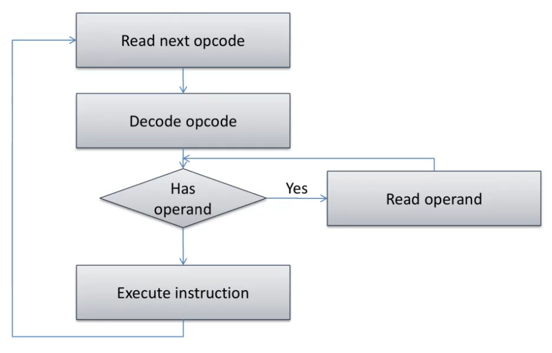
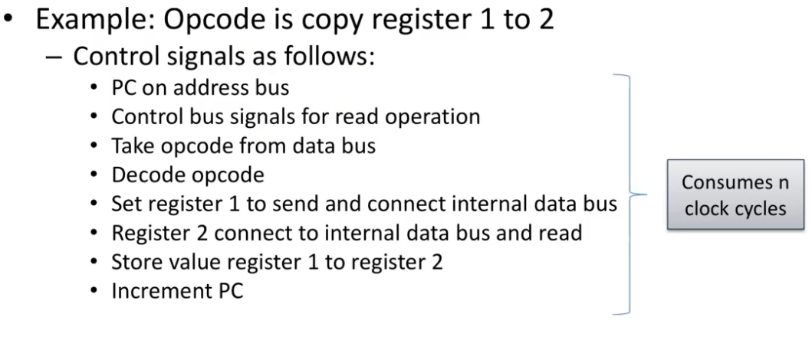
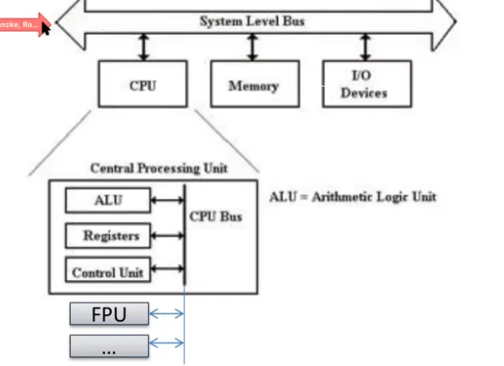
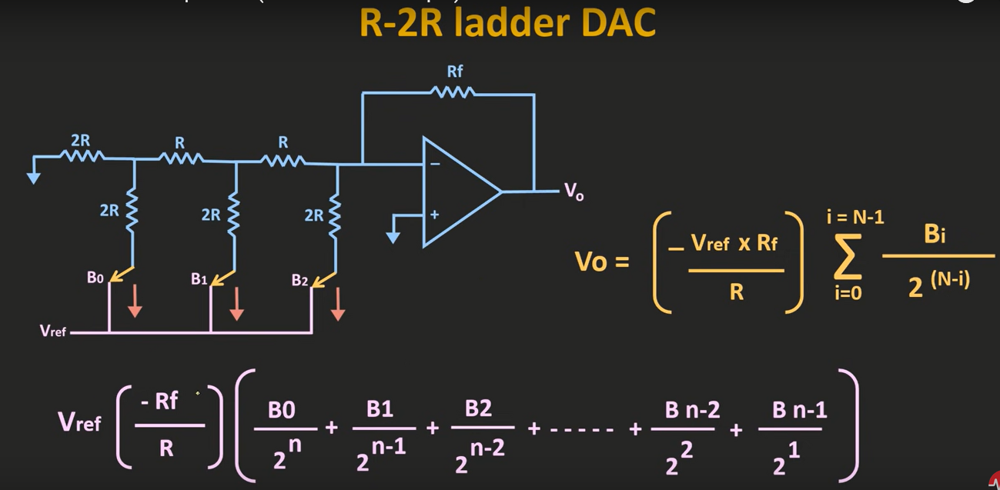

  # Notes Hardwarenahe Softwareentwicklung
  
  ## Inhaltsverzeichnis
- [Notes Hardwarenahe Softwareentwicklung](#notes-hardwarenahe-softwareentwicklung)
  - [Inhaltsverzeichnis](#inhaltsverzeichnis)
  - [Mikroprozessortechnik Grundlagen](#mikroprozessortechnik-grundlagen)
    - [CPU](#cpu)
      - [Arbeitsweise Mikroprozessor](#arbeitsweise-mikroprozessor)
        - [Interne Struktur](#interne-struktur)
      - [Instruktionsarten](#instruktionsarten)
      - [Instruction Sets](#instruction-sets)
        - [CISC (Complex Instruction Set Computer)](#cisc-complex-instruction-set-computer)
        - [RISC (Reduced Instruction Set Computer)](#risc-reduced-instruction-set-computer)
      - [Architekturen](#architekturen)
  - [Mikrocontrollerprogrammierung  - \[Mikroprozessortechnik Grundlagen\]](#mikrocontrollerprogrammierung----mikroprozessortechnik-grundlagen)
    - [HAL API](#hal-api)
      - [HAL\_ADC](#hal_adc)
      - [C-Pointer](#c-pointer)
      - [C und OOP](#c-und-oop)
        - [OOP Prinzipien](#oop-prinzipien)
        - [Designated Initializer](#designated-initializer)
      - [C-Schlüsselwörter](#c-schlüsselwörter)
      - [C-Literale](#c-literale)
    - [ADC (Analog to Digital Converter)](#adc-analog-to-digital-converter)
      - [ADC SAR Logic (Successive Approximation Register)](#adc-sar-logic-successive-approximation-register)
    - [DAC (Digital to Analog Converter)](#dac-digital-to-analog-converter)
    - [Interrupt Systeme](#interrupt-systeme)
    - [Serial Interfaces](#serial-interfaces)
    - [Komponenten für Operationssicherheit](#komponenten-für-operationssicherheit)
      - [Watchdog](#watchdog)
      - [Brownout Protection](#brownout-protection)
      - [Energiesparmodi](#energiesparmodi)
      - [JTAG (Joint Test Action Group)](#jtag-joint-test-action-group)
  - [Softwareentwicklung für MC](#softwareentwicklung-für-mc)
    - [GNU-Toolchains](#gnu-toolchains)
    - [Programmstrukturabhängikeiten](#programmstrukturabhängikeiten)
      - [Scheduling](#scheduling)
        - [Round-Robin](#round-robin)
        - [Round-Robin mit Interrupts](#round-robin-mit-interrupts)
        - [Schedluing mit Funktionszeigern](#schedluing-mit-funktionszeigern)
        - [C-Funtionszeiger](#c-funtionszeiger)
      - [Betriebssysteme](#betriebssysteme)
        - [OS vs. RTOS](#os-vs-rtos)
      - [Bootstrapping / Bootloader](#bootstrapping--bootloader)
      - [Debugging](#debugging)
      - [In Circuit Emulation](#in-circuit-emulation)


## Mikroprozessortechnik Grundlagen

### CPU
- Central Processing Unit
- Ausführung von Programmen durch befolgen von Arbeitsinstruktionen
- früher NAND/NOR Gates, heute Transistoren
- eingebettet mit Peripherie in einem Chip -> microcomputer
  
- Instruktionen / Daten
  - Binär speziell codierte Bitabfolgen
  - Instruktionen weisen CPU an, bestimmte Daten zu verarbeiten
- Bus
  - Sammlung von mehreren elektrischen Leitungen
  - z.B. Datenbus (Daten), Adressbus (Datenspeicheradressen), Steuerbus (Lesen/Schreiben)
  - senden von digitellem Signalen, an all die Komponenten die an den Bus angeschlossen sind
  - Busse sind bidirektional

#### Arbeitsweise Mikroprozessor

- jeder Mikroprozessor verfügt über einen Program Counter (PC)
  - zeigt auf die nächste auszuführende Instruktion
  - wird nach jeder Instruktion inkrementiert
- Der Standart Operationmodus ist der Fetch-Decode-Execute-Zyklus der in einer Endlosschleife ausgeführt wird
  - Fetch
    - Instruktion wird aus dem Speicher geladen
    - PC wird inkrementiert
  - Decode
    - Instruktion wird decodiert
    - Instruktion wird in Mikrooperationen zerlegt
    - möglicherweise werden Operanden aus dem Speicher geladen
  - Execute
    - Mikrooperationen werden ausgeführt
    - Ergebnisse werden in Register geschrieben
    - ggf senden von Ergebnissen zum Speicher über Bus
  - Repeat
    - PC zeigt auf nächste Instruktion
    - Fetch
    - Decode
    - Execute
    - Repeat

- Alle Instruktionen werden Abhängig von einem Clocksignal ausgeführt



##### Interne Struktur

- Control Unit
  - steuert den Fetch-Decode-Execute-Zyklus
    - Übernimmt das decodieren von OPcodes
    
  - steuert die Ausführung von Instruktionen
  - steuert den Zugriff auf den Speicher
  - steuert den Zugriff auf die Peripherie
- Arithmetic Logic Unit (ALU)
  - führt arithmetische und logische Operationen aus
  - z.B. ADD, SUB, MUL, DIV, AND, OR, XOR, NOT, etc.
- Register
  - Gruppen von Flip-Flops
  - Speicherbereiche in der CPU
  - sehr schneller Zugriff
  - genereller Operationsmodus
    - Endlosschleife (endloses durchlaufen von z.B einer while(true) Schleife)
  - typische Instruktionen
    - arithmetische Operationen
    - logische Operationen
    - Speicherzugriffsoperationen
    - Sprungoperationen
    - Interruptoperationen
    - etc.
  - Register sind sehr schnell, aber auch sehr teuer(?)
  - Manche Register sind speziell für bestimmte Aufgaben von der CPU  reserviert
    - z.B. PC, Stackpointer, Statusregister, etc.
- FPU (nicht immer vorhanden)
  - Floating Point Unit
  - spezielle ALU für Gleitkommazahlen
  - z.B. ADD, SUB, MUL, DIV, etc.



#### Instruktionsarten

- Datenverarbeitung
  - arithmetische Operationen
  - logische Operationen
  - Vergleichsoperationen
  - etc.
- Datenübertragung
  - Laden von Daten aus dem Speicher
  - Speichern von Daten im Speicher
  - auch Zugriff auf Peripherie und I/O Module

#### Instruction Sets

- Menge an Instruktionen, die ein Mikroprozessor ausführen kann
- abhängig von jeweiligen Mikroprozessor
- Operationscode opcode
  - Instruktionen werden durch Opcodes codiert
  - z.B. ADD, SUB, MUL, DIV, AND, OR, XOR, NOT, LOAD, STORE, JUMP, etc.
  - stellen bitpattern dar, die operationen einzigartig identifizieren
  - Maschineninstruktion
    - Opcodes mit mehreren Operanden haben (z.B. `ADD R1, R2, R3`)
- Assembler
  - Programmiersprache, die direkt in Maschinencode übersetzt werden kann
  - Assemblerbefehle sind 
    - direkt mit Opcodes verknüpft (Mnemonics)
    - sehr hardwarenah
    - plattformspezifisch

##### CISC (Complex Instruction Set Computer)

  - Microcode (Firmware) wird verwendet um komplexe Instruktionen in Mikrooperationen zu zerlegen
  - eine Instruktion kann mehrere Mikrooperationen ausführen
  - z.B. Intel x86
  - Vorteile:
    - Flexibilität - CPU Instruktionen können geändert/erweitert werden
    - Bug-Fixes können durch Microcode Updates behoben werden
    - Kompatibilität und Emulation von älteren Instruktionen
    - Varianten - Custom Instruktionskits können per micro hinzugefügt werden
    - 
##### RISC (Reduced Instruction Set Computer)

  - Instruktionen sind direkt mit Opcodes verknüpft
  - jede Instruktion führt nur eine Mikrooperation aus
  - jede Instruktion korrespondiert mit einer Hardwareeinheit
    - eine multiplikation in der ALU korrespondiert zu einem echten Hardwaremultiplizierer und nicht einer Folge von Mikrooperationen
  - keine algorithmische Ausführung von Instruktionen
  - Scalar: nur eine Instruktion wird pro Taktzyklus ausgeführt
  - z.B. ARM, AVR, MSP430, etc.

#### Architekturen
- Harvard
  - getrennte Speicher für Daten und Instruktionen
  - getrennte Busse für Daten und Instruktionen
  - Programm kann sich nicht selbst verändern
  - Programm kann nicht selbstständig auf Daten zugreifen
  - gut bei Sicherheitsrelevanten Anwendungen
  - ESP32 ist modifizierte Havard Architektur
- von Neumann
  - gemeinsamer Speicher für Daten und Instruktionen (keine physikalische Trennung)
  - gemeinsamer Bus für Daten und Instruktionen

CPU Register
- Speicherbereiche in der CPU
- sehr schneller Zugriff
- genereller Operationsmodus
  - Endlosschleife (endloses durchlaufen von z.B einer while(true) Schleife)
- typische Instruktionen
  - arithmetische Operationen
  - logische Operationen
  - Speicherzugriffsoperationen
  - Sprungoperationen
  - Interruptoperationen
  - etc.
- Register sind sehr schnell, aber auch sehr teuer(?)


```asm
; beispiel
mov r0, #0x42
add r0, r0, #0x1	
```

SRAM/DRAM

C-Syntax
- Endians
  - lib stdint.h


## Mikrocontrollerprogrammierung  - [Mikroprozessortechnik Grundlagen]


### HAL API
#### HAL_ADC
- example Selector in Projekterstellung in CUBE-IDE

Conversion via Polling
- ADC Start Conversion
- Warten auf ADC-Ready-Flag
- Abfragen der Value-Register

- ADC1->CR2 |= ADC_CR2_ADON; // ADC einschalten


#### C-Pointer
```c
int *a; // Zeiger auf Int
int *b = NULL; // Initialisierung auf NULL
int c = 42; // Variable c mit Wert 42
a = &c; // a zeigt auf c
*a = 33; // c ist über Zeiger auf 33 gesetzt
```

```c
typedef struct {
  char name[163];
  int a;
  int b*;
} data_t;

data_t data; 
data.a = 42; // initialisieren
data_t *ptr_data = &data;

// Zeiger dereferenzieren
ptr_data->a = 42; // (*ptr_data).a = 42
```


Pointer typen
- int -> int*
- void -> void*

Datenverfälschung durch falsche casts
```c
int x;
void *vptr = (void*)&x;
char *y = (char*) vptr; // casten von int* (4 Byte) auf char* (1 Byte) -> 4x so viele Elemente
*y = 42;
```


```c
int x;
void *vptr = (void*)&x;
int *y = (int*)vptr;
*y = 0xDEADFACE;
```

Verwendung von Voidpointern zum Arbeiten mit unbekannten Datentypen 
(Nich so schön)
```c
#include <stdint.h>
void licht_an(void* params) {
  uint_16* ptr_LEDs = (int*) params; // Annahme das ein Array von integern übergeben wird
  for (int i = 0; i < 1000; i++) {
    // anschalten(); // Setzen von RGB werten (zB)
    ptr_LEDs[i] = 0xFFFFFFFF; // RGBA
  }
  // some code
}
```
alternativ, übergeben von parametern als struct:
```c

#define NLAMPS
typedef Struct {
  uint32_t nlamps;
  uint32_t lamps[NLAMPS];
}

void licht_an(void* params) {
  data_t* ptr_data = (data_t*) params;
  for (int i = 0; i < ptr_data->nlamps; i++) {
    ptr_data->lamps[i] = 0xFFFFFFFF;
  }
}
```

Problem:
Größe des Voidpointer ist systemabhängig
```c
int a;
int size = sizeof(a); // 4

sizeof(void*); // ? - Architekturbreite, typischerweise 32 oder 64 bit, aber auch 16 oder 8 bit
```

Header File task.h
- kreieren von Tasks
- benutzt void* um Parameter zu übergeben

---

#### C und OOP
Objekttyp in C
```c
typedef struct {
  // some value
  // some function pointers 
} data_t;

data_t data;
```
##### OOP Prinzipien
- Vererbung
- Polymorphismus
- Kapselung
- Abstraktion

möglich zu implementieren in C, durch inherieren von structs mit entsprechenden Daten und Funktionszeigern
##### Designated Initializer
```c
typedef struct {
  bool on;
  int size;
} data_t;

// designated initializer
data_t data = {
  .on = true,
  .size = 42
};

// oder auch
data_t data_2 = {true, 31}; // keine Zuordnung, nur Reihenfolge
```


#### C-Schlüsselwörter

extern
- Globale Variablen
- Deklaration einer Variable oder Funktion mit nur einer Defintion im Projekt
  - Projektstruktur zb
    - modul1.h
    - modul1.c
    - modul2.h
    - modul2.c
      - ```c
        #include <globals.h>
        // modul2.c kann global_var verwenden
        ```
    - main.h
    - main.c
    - globals.h
      - ```c
        extern int global_var; // global verfügbar machen
        ```
    - globals.c
      - ```c
        #include <globals.h>
        int global_var;
        ```


volatile
- flüctige Speicherbereiche
- verhindert Optimierung von Compilern
- Wert der Variable ist flüchtig und unabhängig vom Code
- Addressraum ist nicht nur SRAM oder Flash, sondern auch Register für Peripherieoperationen
- shared variables beim multithreading
```c
volatile int a;
```

register (obsolet)
- HInweis auf stark genutzte Variablen
- Compiler kann diese Variablen in CPU-Register legen (typischerweise SRAM strukturen)

#### C-Literale
Englisch Literal -> Wörtlich
Schriftliche Darstellung der Werte von Datentypen im code
- 0x... -> Hexadezimal
- 0b... -> Binär
- 0... -> Oktal
- 0...f -> Float
- 0...l -> Long
- 0...u -> Unsigned
- 0...ul -> Unsigned Long
- 0...ull -> Unsigned Long Long

### ADC (Analog to Digital Converter)

* Können im MC auch intern verbaut sein um z.B. Versorgungsspannung zu prüfen oder Temperaturen zu messen.
* Mehrere Pins, die gemultiplext sind, um mehrere Kanäle zu messen z.B. bei STM32
  * typisch sind 12bit ADCs und 10bit

Zu seite 75

$Gegeben:$
$$
\begin{array}{l}
\begin{align}\tag*{}
&U_a &= &\ 3.3V \newline\tag*{}
&U_{max} &= &\ 3,3V \newline\tag*{}
&U_min &= & \ 0V
\end{align}
\end{array}
$$

$$
\begin{array}{l}
\begin{align}\tag*{}
Z&= &\frac{3.3V - 0V}{3.3V - 0V}*(2^{12}-1) \newline\tag*{}
&= &1 * 4095 &= &4095
\end{align}
\end{array}
$$
* Können bei manchen SC auch eingestellt werden, zB. $U_{min} = 1.2V$ und $U_{max} = 3V$
* Auch in nicht linearen Ausführungen

$$
\begin{array}{l}
\begin{align}\tag*{}
U_{LSB} &= &\frac{U_{max} - U_{min}}{2^{12}}
\newline\tag*{}
&=  &\frac{3.3V - 0V}{4096} &= & 0.806V
\end{align}
\end{array}
$$

#### ADC SAR Logic (Successive Approximation Register)

* $V_{in} = xV_{ref}$ , $x\ in [-1,1] $
* $sgn(x) = +1 for x \geq 0$, $-1 for x \lt 0$
* Je höher die Auflösung des SAR, desto genauer die Messung, aber desto länger die Abtastzeit

### DAC (Digital to Analog Converter)

* Umwandlung von digitalen Werten in analoge Spannungen

$$
\begin{array}{l}
\begin{align}\tag*{}
u_a = \frac{Z}{2^n-1}(U_{max} - U_{min})+U_{min}
\end{align}
\end{array}
$$


___

[Video R-2R ladder DAC](https://www.youtube.com/watch?app=desktop&v=Pc1aFloxSMw)



### Interrupt Systeme

### Serial Interfaces

__S. 83__

Z.B:
* I2C
  * 
* SPI (Serial Peripheral Interface)
  * SCLK (Serial Clock)
  * MOSI (Master Out Slave In)
  * MISO (Master In Slave Out)
  * SSN  (Slave Select)
  *
  * Wenige Meter Reichweite
  * individuelle Datenraten
* UART ()
* CAN (Controller Area Network)
  * bis 40 Meter
  * bis 1Mbit/s
  * Oft in Automobilindustrie
  * Verschiedene Signale
    * CAN High
    * CAN Low
    * CAN Shield
* USB (Universal Serial Bus)
  * Bidirektional
  * verschiedene Datenraten
  * Clock Signal
  * Differenzielle Signalübertragung
    * Phaseninvertierung der Signale
    * hierdurch wird die Störanfälligkeit verringert
  
  STM32 kommt mit USB-Controller

  ESP32 wandelt zu RS232 um

* IrDA (Infrared light)
  * Kabellos, Sichtlinie
  * von 115kbit/s bis 4Mbit/s
  * 850nm bis 950nm Wellenlänge
  

* Common GND
  * GND muss verbunden sein
  
* DATA interface
  * Codierung der Signale durch Protokoll
* Clock
  * Asynchron
    * Keine Synchronisation der Datenübertragung
    * unsynchronisierte Clocks
  * Synchron
    * Master und Slave müssen sich auf Datenübertragung einigen
    * Extra Clock Leitung

### Komponenten für Operationssicherheit

#### Watchdog

Timer, der einen initialen Wert runterzählt und bei 0 einen Chipreset auslöst

* Braucht regelmäßige Aktualisierung in Usercode, sonst wird ein Reset ausgelöst
* Prävention gegen Deadlocks

#### Brownout Protection

* Schutz vor zu niedriger Spannung von Spannungsversorgung
* Chipreset bei zu niedriger Spannung möglich

#### Energiesparmodi

* Möglichkkeit, individuelle Komponenten abzuschalten um Energie zu sparen

#### JTAG (Joint Test Action Group)

Serielles Interfaces, mit dem verschiedene Geräte angeschlossen werden können

> * Bei ESP32 über Expansionboard
> * Unterstütz Debugging
>

* TDI (Test Data In)
* TDO (Test Data Out)
* TCK (Test Clock)
* TMS (Test Mode Select)
* TRST (Test Reset)
* RTCK (Return Test Clock)

## Softwareentwicklung für MC

### GNU-Toolchains

* 8051 
* ARM
* Atmel
* MSP430
* PIC

### Programmstrukturabhängikeiten

* Größe des Programms 
* Funktionalität 
  * z.B. Echtzeitanforderungen
  * z.B. Speicheranforderungen
  * z.B. Energieanforderungen

#### Scheduling

##### Round-Robin

* Jeder Task bekommt eine bestimmte Zeit zugeteilt
* Nach Ablauf der Zeit wird der nächste Task ausgeführt
* Nachdem alle Tasks ausgeführt wurden, wird wieder von vorne begonnen

##### Round-Robin mit Interrupts

* Interrupts können die Reihenfolge der Tasks ändern

##### Schedluing mit Funktionszeigern

* Whileschleife, die eine Que abarbeitet
* Que ist eine Liste von Funktionszeigern
* Jeder Task wird als Funktionszeiger in die Que eingefügt
* Nach Abarbeitung wird der Funktionszeiger wieder entfernt

```c
void process(void) {
  init();
  enable_interrupts();
  init_que();
  while (1) {
    if (que_is_empty()) {
      // do nothing
    } else {
      void (*task)(void) = que_get();
      task();
    }
  }
}
```

##### C-Funtionszeiger

```c
int addInt(int n, int m) {
  return n+m;
}

int (*func_ptr)(int, int); // function pointer 
func_ptr = &addInt; // Point to funciton
int sum = func_ptr(2,3); // Call function
```

Alternativ:

```c
// use typedef to define function pointer
typedef int (*func_ptr)(int, int);
// note thtat the typedef name is ideed func_ptr

func_ptr functionFactory(int n ) {
  printf("Got parameter %d\n", n);
  func_ptr functionPointer = &addInt;
  return functionPointer;
};
```

```c
#include <iostream>

int addInt(int n, int m) { // basic function
    return n+m;
}

// use typedef to reduce length of fcn ptr declaration
typedef int (*f_ptr_t)(int, int);

typedef struct{
    f_ptr_t fcn_ptr;
    int a, b, c;
} my_class_t;

int main() {
    my_class_t my_class = {
        .fcn_ptr = &addInt,
        .a = 1,
        .b = 2,
        .c = 0
    };  // initialize struct

    // calculate c
    my_class.c = my_class.fcn_ptr(my_class.a, my_class.b);
    printf("c = %d\n", my_class.c);
    return 0;
}
```

Emulation von Objektorientierter Programmierung in C

#### Betriebssysteme

* Echtzeitbetriebssysteme (RTOS)
  * Zeitkritische Anwendungen gehandelt durch Interrupts
  * Unterteilung in
    * Hard Realtime
      * Echtzeit muss eingehalten werden
      * z.B. Airbag
    * Firm Realtime
      * Echtzeit muss eingehalten werden, aber wird meist
      * Verlässlickeit der Signale nach Deadline nicht mehr garantiert.
    * Soft
      * Servicequalität wird verschlechtert, wenn Deadline nicht eingehalten wird
##### OS vs. RTOS

* OS
  * Designt für faires Verteilen der Resources an die Tasks

* RTOS
  * Vorhersagbare Resourcenmenge und Timing

#### Bootstrapping / Bootloader

- Manche MC haben Bootloader, die das Programmieren des MCs vereinfachen
- Bootloader ist ein Programm, das auf dem MC läuft und das Programmieren des MCs ermöglicht
- Bootloader wird über JTAG oder UART auf den MC geladen

#### Debugging

- Debugging über JTAG
- Debugging über UART
- Debugging über SWD (Serial Wire Debugging)
- Trace Debugging
  - Callstack wird aufgezeichnet und kann analysiert werden
- Patching
  - keine Komplett neue Software, sondern nur ein Patch, der die Software verbessert
- Disasemblierung
  - Assemblercode wird aus dem Maschinencode generiert

#### In Circuit Emulation

- komplette emulation des MCs