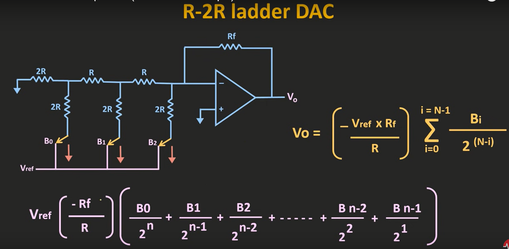

# Vorlesung 5

### ADC (Analog to Digital Converter)

* Können im MC auch intern verbaut sein um z.B. Versorgungsspannung zu prüfen oder Temperaturen zu messen.
* Mehrere Pins, die gemultiplext sind, um mehrere Kanäle zu messen z.B. bei STM32
  * typisch sind 12bit ADCs und 10bit

Zu seite 75

$Gegeben:$
$$
\begin{array}{l}
\begin{align}\tag*{}
&U_a &= &\ 3.3V \newline\tag*{}
&U_{max} &= &\ 3,3V \newline\tag*{}
&U_min &= & \ 0V
\end{align}
\end{array}
$$

$$
\begin{array}{l}
\begin{align}\tag*{}
Z&= &\frac{3.3V - 0V}{3.3V - 0V}*(2^{12}-1) \newline\tag*{}
&= &1 * 4095 &= &4095
\end{align}
\end{array}
$$
  * Können bei manchen SC auch eingestellt werden, zB. $U_{min} = 1.2V$ und $U_{max} = 3V$
  * Auch in nicht linearen Ausführungen

$$
\begin{array}{l}
\begin{align}\tag*{}
U_{LSB} &= &\frac{U_{max} - U_{min}}{2^{12}}
\newline\tag*{}
&=  &\frac{3.3V - 0V}{4096} &= & 0.806V
\end{align}
\end{array}
$$

#### ADC SAR Logic (Successive Approximation Register)

* $V_{in} = xV_{ref}$ , $x\ in [-1,1] $
* $sgn(x) = +1 for x \geq 0$, $-1 for x \lt 0$
* Je höher die Auflösung des SAR, desto genauer die Messung, aber desto länger die Abtastzeit

### DAC (Digital to Analog Converter)

* Umwandlung von digitalen Werten in analoge Spannungen

$$
\begin{array}{l}
\begin{align}\tag*{}
u_a = \frac{Z}{2^n-1}(U_{max} - U_{min})+U_{min}
\end{align}
\end{array}
$$


___

[Video R-2R ladder DAC](https://www.youtube.com/watch?app=desktop&v=Pc1aFloxSMw)



### Interrupt Systeme

### Serial Interfaces

__S. 83__

Z.B:
* I2C
  * 
* SPI (Serial Peripheral Interface)
  * SCLK (Serial Clock)
  * MOSI (Master Out Slave In)
  * MISO (Master In Slave Out)
  * SSN  (Slave Select)
  *
  * Wenige Meter Reichweite
  * individuelle Datenraten
* UART ()
* CAN (Controller Area Network)
  * bis 40 Meter
  * bis 1Mbit/s
  * Oft in Automobilindustrie
  * Verschiedene Signale
    * CAN High
    * CAN Low
    * CAN Shield
* USB (Universal Serial Bus)
  * Bidirektional
  * verschiedene Datenraten
  * Clock Signal
  * Differenzielle Signalübertragung
    * Phaseninvertierung der Signale
    * hierdurch wird die Störanfälligkeit verringert
  
  STM32 kommt mit USB-Controller

  ESP32 wandelt zu RS232 um

* IrDA (Infrared light)
  * Kabellos, Sichtlinie
  * von 115kbit/s bis 4Mbit/s
  * 850nm bis 950nm Wellenlänge
  

* Common GND
  * GND muss verbunden sein
  
* DATA interface
  * Codierung der Signale durch Protokoll
* Clock
  * Asynchron
    * Keine Synchronisation der Datenübertragung
    * unsynchronisierte Clocks
  * Synchron
    * Master und Slave müssen sich auf Datenübertragung einigen
    * Extra Clock Leitung

### KOmponenten für Operationssicherheit

#### Watchdog

Timer, der einen initialen Wert runterzählt und bei 0 einen Chipreset auslöst

* Braucht regelmäßige Aktualisierung in Usercode, sonst wird ein Reset ausgelöst
* Prävention gegen Deadlocks

#### Brownout Protection

* Schutz vor zu niedriger Spannung von Spannungsversorgung
* Chipreset bei zu niedriger Spannung möglich

#### Energiesparmodi

* Möglichkkeit, individuelle Komponenten abzuschalten um Energie zu sparen

#### JTAG (Joint Test Action Group)

Serielles Interfaces, mit dem verschiedene Geräte angeschlossen werden können

> * Bei ESP32 über Expansionboard
> * Unterstütz Debugging
>

* TDI (Test Data In)
* TDO (Test Data Out)
* TCK (Test Clock)
* TMS (Test Mode Select)
* TRST (Test Reset)
* RTCK (Return Test Clock)

## Softwareentwicklung für MC

### GNU-Toolchains

* 8051 
* ARM
* Atmel
* MSP430
* PIC

### Programmstrukturabhängikeiten

* Größe des Programms 
* Funktionalität 
  * z.B. Echtzeitanforderungen
  * z.B. Speicheranforderungen
  * z.B. Energieanforderungen

#### Scheduling

##### Round-Robin

* Jeder Task bekommt eine bestimmte Zeit zugeteilt
* Nach Ablauf der Zeit wird der nächste Task ausgeführt
* Nachdem alle Tasks ausgeführt wurden, wird wieder von vorne begonnen

##### Round-Robin mit Interrupts

* Interrupts können die Reihenfolge der Tasks ändern

##### Schedluing mit Funktionszeigern

* Whileschleife, die eine Que abarbeitet
* Que ist eine Liste von Funktionszeigern
* Jeder Task wird als Funktionszeiger in die Que eingefügt
* Nach Abarbeitung wird der Funktionszeiger wieder entfernt

```c
void process(void) {
  init();
  enable_interrupts();
  init_que();
  while (1) {
    if (que_is_empty()) {
      // do nothing
    } else {
      void (*task)(void) = que_get();
      task();
    }
  }
}
```

##### C-Funtionszeiger

```c
int addInt(int n, int m) {
  return n+m;
}

int (*func_ptr)(int, int); // function pointer 
func_ptr = &addInt; // Point to funciton
int sum = func_ptr(2,3); // Call function
```

Alternativ:

```c
// use typedef to define function pointer
typedef int (*func_ptr)(int, int);
// note thtat the typedef name is ideed func_ptr

func_ptr functionFactory(int n ) {
  printf("Got parameter %d\n", n);
  func_ptr functionPointer = &addInt;
  return functionPointer;
};
```

```c
#include <iostream>

int addInt(int n, int m) { // basic function
    return n+m;
}

// use typedef to reduce length of fcn ptr declaration
typedef int (*f_ptr_t)(int, int);

typedef struct{
    f_ptr_t fcn_ptr;
    int a, b, c;
} my_class_t;

int main() {
    my_class_t my_class = {
        .fcn_ptr = &addInt,
        .a = 1,
        .b = 2,
        .c = 0
    };  // initialize struct

    // calculate c
    my_class.c = my_class.fcn_ptr(my_class.a, my_class.b);
    printf("c = %d\n", my_class.c);
    return 0;
}
```

Emulation von Objektorientierter Programmierung in C

#### Betriebssysteme

* Echtzeitbetriebssysteme (RTOS)
  * Zeitkritische Anwendungen gehandelt durch Interrupts
  * Unterteilung in
    * Hard Realtime
      * Echtzeit muss eingehalten werden
      * z.B. Airbag
    * Firm Realtime
      * Echtzeit muss eingehalten werden, aber wird meist
      * Verlässlickeit der Signale nach Deadline nicht mehr garantiert.
    * Soft
      * Servicequalität wird verschlechtert, wenn Deadline nicht eingehalten wird
##### OS vs. RTOS

* OS
  * Designt für faires Verteilen der Resources an die Tasks

* RTOS
  * Vorhersagbare Resourcenmenge und Timing

#### Bootstrapping / Bootloader

- Manche MC haben Bootloader, die das Programmieren des MCs vereinfachen
- Bootloader ist ein Programm, das auf dem MC läuft und das Programmieren des MCs ermöglicht
- Bootloader wird über JTAG oder UART auf den MC geladen

#### Debugging

- Debugging über JTAG
- Debugging über UART
- Debugging über SWD (Serial Wire Debugging)
- Trace Debugging
  - Callstack wird aufgezeichnet und kann analysiert werden
- Patching
  - keine Komplett neue Software, sondern nur ein Patch, der die Software verbessert
- Disasemblierung
  - Assemblercode wird aus dem Maschinencode generiert

#### In Circuit Emulation

- komplette emulation des MCs